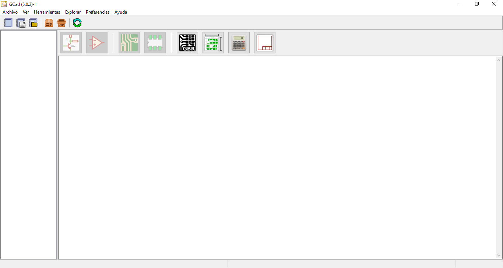
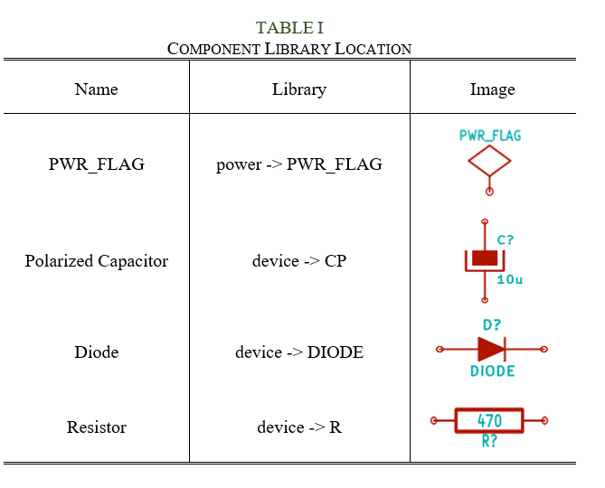
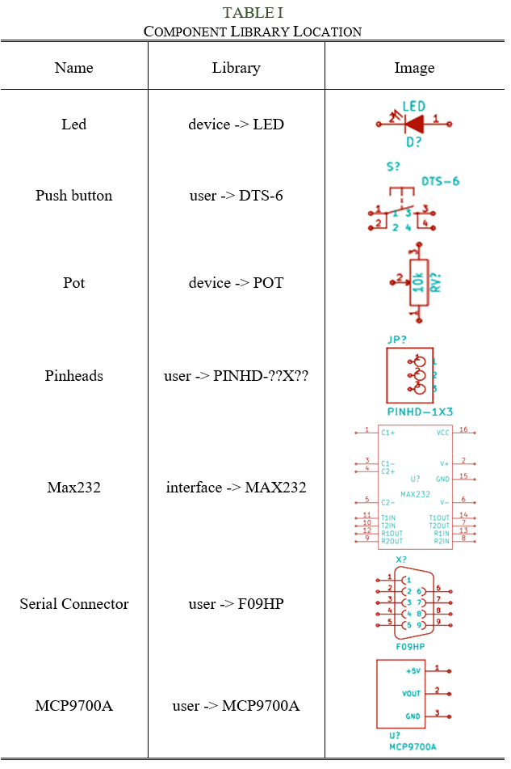

# Practice 1. Developiong the PCB (Schematic)

## Objectives

The student will make the schematic design of a minimum card system, which he/she will work with throughout the semester. The minimum system contains following elements: potentiometer and thermistor ICs, serial port, power connector, LCD , push buttons,  LEDs, and keyboard connections. The students will use the design software ‘Kicad’ for the entire design (schematic and layout.)

## Introduction

Microcontrollers are all around  he world. Each day, Microcontrollers, are more present in the many aspects of our lives: in our work, inside our houses, and in more. We can find them controlling small devices like cellphones, microwaves, washing machines, and televisions.

A microcontroller is one device or chip that is used to govern one or more processes. For example, the controller that regulates the room temperature of an air conditioner; it has a sensor that continuously measures the internal temperature and, when the preset limits are exceeded, it generates the necessary signals to adjust the temperature.

## State of the Art

### The practices and the PIC microcontroller

The main objective of this practices is to provide students the foundation to fully understand the operation of the PIC18F45K50 microcontroller. This will be achieved through 11 documents that will guide the reader to create their own electronic card or Printed Circuit Board (PCB) and to be able to program it; in order to, execute different functions.

The advantages of ta PIC microcontroller to others on the market, which is why it will be used throughout this manual, are as follows:

- Easy to operate.
- There is enough documentation to work with it and it’s easy to obtain it.
- The price is comparatively lower than its competitors.
- It has a high operating speed.
- Development tools are cheap and easy to use.
- There are a variety of hardware that can record, erase and check the behavior of PIC.
- Once you learn to handle a PIC, it will easier to handle any other models of microcontrollers.

### KiCad EDA Software

KiCad is an open source software suite for Electronic Design Automation (EDA). The programs handle Schematic Capture,
and PCB Layout with Gerber output. The suite runs on Windows, Linux and macOS and is licensed under GNU GPL v3. The
first release date was in 1992 by its original author, Jean-Pierre Charras, but is now currently under development by
the KiCad Developers Team. 

## Results

In this section, you must report the outcomes of the laboratory activities.

### Follow the next 'Project Configuration' Steps

1. Download and install the open source (free) software ‘KiCad EDA’ form its official [web page](https://kicad-pcb.org/).  
2. Click on ‘kicad.exe’ application. Now, you are in the main window: ‘Kicad Project Manager,’ as shown in Fig. 1. From here, you will be capable of accessing 5 different tools: EESchema, Cvpcb, PCBnew, GerbView and Bitmpa2Component.

3. Create a new project: **File→New→Project… [CTRL + N]**. Open the project folder, all files in your project will be saved there. The project will be saved with the ‘.pro’ extension. 
***NOTE:*** *Make sure that the PATH of your project does not include special characters like “spaces, accentuations, letter ‘ñ’, etc.”*
4. Begin to create the schematic. Let us open the EESchema editor, It is the first button on the left of the ‘Project Manager.’ If a dialog message pops, select: *‘Create an empty symbol library table…’*.
5. Click the icon **‘Page Settings’**  located in the top of the toolbar. Select the size ‘A3’ and enter the title of your schematic. You can see there is more information that can be provided if necessary. Once completed the necessary information, click **‘OK.’** This information will appear in the lower right corner of the design page. 
6. Download from this repository the libraries needed for the project. Add all the libraries into **'KiCad': Preferences
   -> Manage Symbol Libraries ...** Click on ***'Project Specific Libraries...'*** tab. Nextr, click on the button
   **'Browse Libraries...'** and search for the folder where you save the libraries. Select all the libaries and click
   **'OK'**.
7. Now let's add      dd the first component of the design. Click the iceon ‘Place symbol’  in the toolbar on the right.
   The same functionality is obtained by pressing the shortcut [Shift + A]. If a warning message pops, ignore it and
   click ‘OK.’ The component selection window appears. *NOTE: You can see a list of all availabe shortcut by pressing [Ctrl + F1].*
8. Select with a click on the ‘+ symbol’ the library ‘device.’ Here you have a list of all available components in the library ‘device,’ which is the one that contains the most commonly used components.
9. Scroll down and click the resistance ‘R.’ This action will close the component selection window and take you back to the schematic sheet.
10. Place the component in the schematic by clicking wherever you want it to be. You can zoom in or out the ‘scroll’ of your mouse.
11. With the mouse over the ‘R’ component, press the key [R]. You will see how the component rotates 90°; you do not need to click on the component to rotate it.
12. Click on the middle of the component and select: Properties→Edit value... You can get the same result on the component by positioning the curse above it and pressing the key [V]. Also with the key [E], you will have a window with the more general properties. When you click the right mouse button on the component, all the possible ‘shortcut keys’ actions will appear.
13. The value of the component appears. Replace the current value ‘R’ for ‘1k’ and click ‘OK.’ Do not modify the reference field (R?), this option is automatically modified later. The value inside the resistor should now be ‘1k,’.
14. If you made a mistake and want to delete a component, you must right-click the mouse on the component and select ‘Delete.’ This action will delete the component from the schematic. Also, you can delete it by pressing the key [Del] and hovering the mouse over it.
15. You can duplicate an existing component in your schematic by positioning the cursor on the component and pressing the key [C]. Then, click on the wanted position to place the new component.
16. Press right click on the resistance. Select ‘Drag.’ Reposition the component and left click to drop it. The same function can be done by clicking the key [G]. You can use the key [R] to rotate the component. NOTE: The right-click option ‘Move X’ (equivalent to key [M]) is a viable option to move any compenent, but is used for components that have not been connected.
17. To add the symbols +5V and GND (reference), select the button ‘Place a power port’  in the toolbar located in the right. You may also use the shortcut key [A] on the datasheet and select the ‘power’ library.
18. This is also the same procedure to add +5VA (+5V alternative) and GNDA (alternative reference). In your PCB design will be the two different types of power: direct and alternative. You need to be careful in adding each type of power on your design.
19. To wire the components, you must click on the icon ‘Place a wire’  located in the toolbar on the right. NOTE: Be careful not to select the ‘Place a bus’ below this button. The use of that button will be explained later.
20. Sometimes it is good to give names to the wires using ‘labels’ which is an alternative form of wiring connections between components. To do this, you must click on the icon ‘Place net label’  in the toolbar on the right. You can also press the command [Shift + L]. Sometimes, ‘labels’ are used only for purposes of information on one line.
21. The non-connected terminals must be identified to avoid errors or warnings in the schematic. To mark a connections that will be free, you must select the icon ‘Place no connection flag’  located in the toolbar on the right, and place the ‘X’ symbol on the free terminal.
22. It is necessary to add ‘Power Flags’ to signal ‘KiCad’ that the power comes from a valid source. Press key [A], double click on the ‘power’ library and search for a ‘PWR_FLAG’ .
23. Sometimes it is good to write comments or notes in the schematic. To do so, you can select: Place→Graphic Text… You can also press the command [Shift + T].

### Create the Schematic of our PCB design

24. Now, it is time to assemble the schematic design needed to make the PCB of this manual, as shown in this
    [file](./Minimum_card_system.pdf). Table I indicates in which library is included each component.
    
    
    
25. All components must have a unique identifier. In fact, many of the added components are named after ‘R?’ or ‘J?.’ To assign an ID automatically, you can click on the icon ‘Annote schematic symbols’ .
26. In the window ‘Annotate Schematic’ select: Use the entire schematic and click on the ‘Annotate’ button. Click ‘OK’ in the confirmation message that appears on the screen, then click on ‘Close.’ You will see how all the ‘?’ have been replaced by numbers. This identifier is unique.

### Check and Prepare our PCB design

27.  Now let’s check the schematic for error(s). Click the icon ‘Perform Electrical Rules Check’ . Click the ‘Run’ button. A report informing you of any error, warning and/or disconnected terminals will appear. You should have 0 errors and 0 warnings. If any of the cases, a green arrow appears in the schematic positioned where the error or warning exists. For further information about the errors, select on Create ERC file report and then press ‘Run.’ 
28. The schematic is finished. Now we can create a ‘Netlist file’ that will be added to the impression of each component. Click on the icon ‘Generate Netlist’  located in the toolbar on the top. Click on ‘Generate Netlist’ and then ‘Save.’ Save it with the name that appears by default.
29. Now you may close the schematic editor.

### Report
For this practice, modify only the Conclusion section. Commit an push the changes on the fork of this repository and add
upload the link on Canvas.

### File uploads
Commit and push the files with extensions .pro, .sch, and .net created once you completed all the steps of the document
in forked repository.

### Demonstration
Screenshot the image of the complete schematic and upload it at the repository.

## Conclusion

In this section, you should add the conclusions, suggestions, and/or problems of the laboratory activities. Each team member must add his/her own conclusion (5 lines as minimum for each member).
