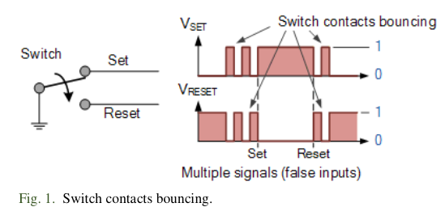
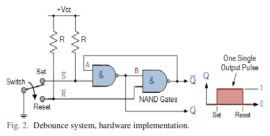
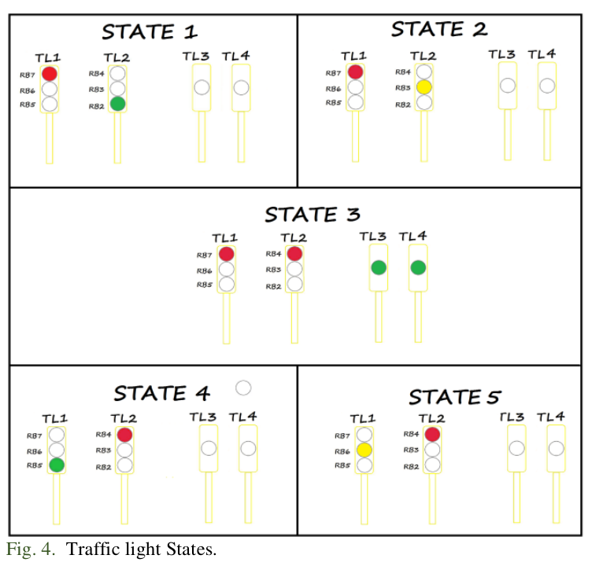
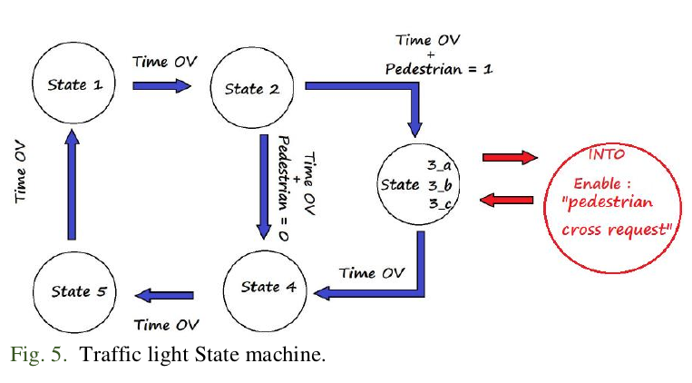

# Practice 10. Interrupts

## Objectives
The student will write a C language program where he
will use the interrupt service routine (ISR) for attendance
core and peripheral hardware events.

## Introduction

Microcontrollers are all around  he world. Each day, Microcontrollers, are more present in the many aspects of our lives: in our work, inside our houses, and in more. We can find them controlling small devices like cellphones, microwaves, washing machines, and televisions.

A microcontroller is one device or chip that is used to govern one or more processes. For example, the controller that regulates the room temperature of an air conditioner; it has a sensor that continuously measures the internal temperature and, when the preset limits are exceeded, it generates the necessary signals to adjust the temperature.

## State of the Art

### The practices and the PIC microcontroller

The main objective of this practices is to provide students the foundation to fully understand the operation of the PIC18F45K50 microcontroller. This will be achieved through 11 documents that will guide the reader to create their own electronic card or Printed Circuit Board (PCB) and to be able to program it; in order to, execute different functions.

The advantages of ta PIC microcontroller to others on the market, which is why it will be used throughout this manual, are as follows:

- Easy to operate.
- There is enough documentation to work with it and it’s easy to obtain it.
- The price is comparatively lower than its competitors.
- It has a high operating speed.
- Development tools are cheap and easy to use.
- There are a variety of hardware that can record, erase and check the behavior of PIC.
- Once you learn to handle a PIC, it will easier to handle any other models of microcontrollers.

###  Interrupts
Interrupt is an event that will cause the CPU to stop the
normal program execution and provide some service to the
event. The solution for handling multiple pending interrupts is
to prioritize all interrupts. The interrupt at the higher priority
will be attended before than the interrupt at the lower priority.
The PIC18 supports two-level interrupt priority only and let the
software to decide which pending interrupt to service. The
PIC18 Interrupt Sources are the core group and peripheral
group. For the first group we have four edge-triggered INT pin
(INT0...INT3) interrupts, TMR0 overflow interrupt. Port B
pins change (any one of the upper four Port B pins), For the
second group we have On-chip peripheral function interrupts as
A/D converter, USART transmit, Capture/Compare, etc.

### Push button debounce
When you push a button, ideally, you can imagine that a
perfect "square signal" is generated, but the fact is not so. When
you push a button, press a micro switch or flip a toggle-switch,
two metal parts come together. It might seem that the contact is
make instantly, but it is not quite correct. Inside the switch there
are moving parts. When you push the switch, it initially makes
contact with the other metal part, but just in a brief split of a
microsecond. Then it makes contact a little longer, and then
again a little longer. At the end of the switch is fully closed. The
switch is bouncing between in-contact, and not in-contact, as it
is shown in Fig. 1, causing false inputs and abnormal or
erroneous behavior. To avoid this, we need to implement a
debounce system. There are several options, from RC (passive)
arrangements to TTL (logic) implementations. Fig. 2 shows a
latch SR implementation for a debounce system, and Fig. 3
shows the software C code version for the implementation.

### Time for roll over

Where:
    - TMRx: timer counter register.
    - Time: Period from "initial count" in TMRx to the moment when TMRx has an overflow (from 0xFF/0xFFFF to 0x00/0x0000).
    - TimerMode: It may be 16 or 8 bits
    - Tcy: Internal Instruction Cycle of 4/Fosc.
    - Prescaler: Device for frequency divider.

## Results

In this section, you must report the outcomes of the laboratory activities.

### main.c programming structure.

Remember to follow the programming structure: 

1.	Start your C program with the “LIBRARIEs / HEADERs SECTION” section… 

2.	Continue your C code with the “DIRECTIVEs SECTION” section… 

3.	Next, write the “DATA TYPEs SECTION” section.

4.	Now, write the “FUNCTIONs DECLARATION” section…

5.	It is time for the “MAIN” section… 

6.	Last step is to write the “FUNCTIONs” section… 

###  Traffic light
1. Create a new project in the MPLAB X IDE for the
“Curiosity” board (PIC18F45K50 microcontroller).

2. Create a C program to control a ‘traffic light system.’

3. Traffic light system specifications:

    - Traffict light 1 drives North to South traffic. Use three LEDs connected to the MCU port to represent this traffic light.

    - Traffict light 2 drives West to East traffic. Use three LEDs connected to the MCU port to represent this traffic light.

    - Traffict light 3 and traffict light 4 drive pedestrian cross. Use two LEDs connected to the MCU port to represent these traffic lights. 
    
    - There are five possible states for the system, as shown in Fig. 4.

    - Use a push button connected to the MCU port to represent the pedestrian interface with the traffic light system. This push button must generate the interrupt to attend the “pedestrian cross request.”
    
    - If there is not any “pedestrian cross request” pending the system behavior is like: St1, St2, St4, St5, St1, St2, St4, St5, St1, ... 
    
    - At any time people can make a “pedestrian cross request”
        
        * If there is no any pending request, the request will be scheduled with the default “time for cross (1 second)”.
        
        * If there is already a pending request, the “time for cross” will be increased (eg. three generated cross request -three presses of the push button- will increase the ‘time for cross’ by 3 seconds.) “Time for cross” can be increased a maximum of eight times before the request be atended.
    
    - If there is a “pedestrian cross request” pending, the system will attend the request inserting one time the “State 3” between “State 2” and “State 4” like: St1, St2, St3, St4, St5, St1, St2, St4, St5, St1, ...
    
    - A suggestion for the implementation of the traffic light system is to think on it as a state machine design, as shown in Fig. 5.

    - The time for each state should be as follows: St1 = 3 seconds, St2 = 1 second, St3 = depends of the times the push button was pressed (1s to 8s), St4 = 3 seconds, and St5 = 1 second. The time must be generated with Timer0.

### Traffic light system: Hardware implementation.

4. Connect the push button to RB2 pin. The clean signal (without debounce) will be output from the RB1 pin, so the RB1 must be connected to the RB0 pin to generate the INT0 interrupt.

5. To simulate the traffic lights, connect the PORTD to the 8 LEDs of your ‘minimum card system’ as follows: RD7 and RD3 for pedestrian lights; RD6-green, RD5-yellow,RD4-red lights of North to South traffic; and RD2-green, RD1-yellow, RD0-red lights of West to East traffic.

### Report
For this practice, add to the Result Section the following:
    - image of the BUILD SUCCESSFUL window.
    - image of the connections between the Curiositiy board and  your minimum card system (Proteus). The image must contain a short description, and a footnote.
    - description of the problems found and solutions.
    - flow diagram of your program implementation.

### File uploads
Commit and push the file main.c created once you completed all the steps of the document in the repository.

### Demonstration
Record a video of the practice’s functionality and upload it on youtube. The video must contain a short explanation.

## Conclusion
In this section, you should add the conclusions, suggestions, and/or problems of the laboratory activities. Each team member must add his/her own conclusion (5 lines as minimum for each member).
