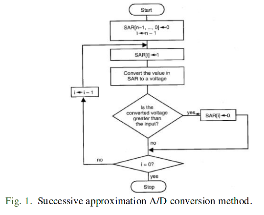
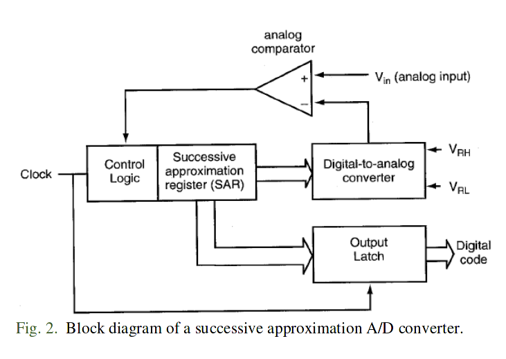
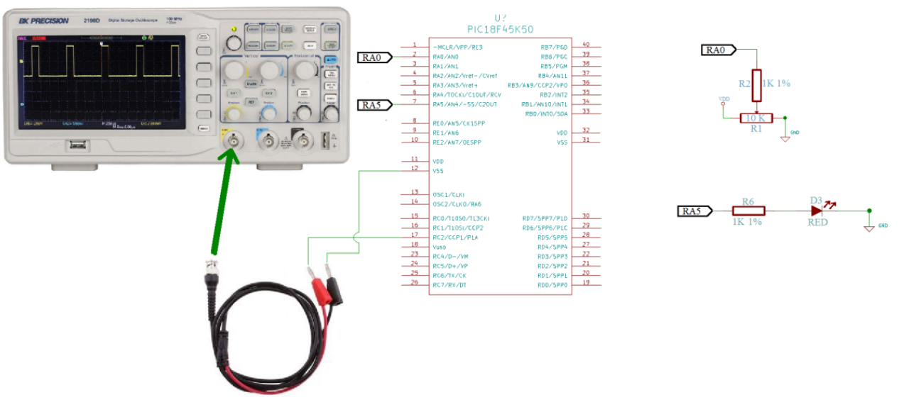

# Practice 11. Capture/Compare/PWM Modulesand Analog-to-Digital Converter

## Objectives
The student will write a C language program where he will use the Capture/Compare/PWM Modules and Analog-to-Digital Converterfor provide the microcontroller with the ability to drive analog signalsin order to read transducers and sensors,and control actuators

## Introduction

Microcontrollers are all around he world. Each day, Microcontrollers, are more present in the many aspects of our lives: in our work, inside our houses, and in more. We can find them controlling small devices like cellphones, microwaves, washing machines, and televisions.

A microcontroller is one device or chip that is used to govern one or more processes. For example, the controller that regulates the room temperature of an air conditioner; it has a sensor that continuously measures the internal temperature and, when the preset limits are exceeded, it generates the necessary signals to adjust the temperature.

## State of the Art

### The practices and the PIC microcontroller

The main objective of this practices is to provide students the foundation to fully understand the operation of the PIC18F45K50 microcontroller. This will be achieved through 11 documents that will guide the reader to create their own electronic card or Printed Circuit Board (PCB) and to be able to program it; in order to, execute different functions.

The advantages of ta PIC microcontroller to others on the market, which is why it will be used throughout this manual, are as follows:

- Easy to operate.
- There is enough documentation to work with it and it’s easy to obtain it.
- The price is comparatively lower than its competitors.
- It has a high operating speed.
- Development tools are cheap and easy to use.
- There are a variety of hardware that can record, erase and check the behavior of PIC.
- Once you learn to handle a PIC, it will easier to handle any other models of microcontrollers.


### Pulse Width Modulation PWM

A PWM signal is a method for generating an analog signal using a digital source. A PWM signal consists of two main components that define its behavior: a duty cycleand a frequency.The duty cycle is the percentage of time that the signal is in a "high state" respect the total time it takes to complete a cycle. When turning off and on a digital signal at a sufficiently fast speed, and with a certain duty cycle, the output will appear to behave as an analog signal of constant voltage when power is supplied to the devices. For example, if a digital signal (high = 5, low = 0) is cycled fast enough and with a 60% duty cycle. Then the voltage seen at the output seems to be the average voltage of 5 * 0.6 = 3V. PWM signals are used for a wide variety of control applications like to control DC motors, control valves, pumps, hydraulic systems and other mechanical parts.

### A/D Converters
An A/D converter makes the quantization of an input analog signal in order toassign a digital value to that signal.The resolution of the converter depend on the number of bits used to represent the conversion result. Typical converters are implemented on 8, 10, 12, and 16 bits..The principal A/D Conversion Algorithms are: Parallel (flash)A/D converter, Slope and double-slope A/D converter, Sigma-delta A/D converter, and Successive approximation A/D converter.The PIC18 A/C converter generates a 10-bit binary result via successive approximation, as shown in Fig. 1,and stores the conversion result into its ADC result registers.




Fig.2 shows a block diagram for the Successive approximation A/D conversion implementation.



## Results

In this section, you must report the outcomes of the laboratory activities.

### main.c programming structure.

Remember to follow the programming structure: 

1.	Start your C program with the “LIBRARIEs / HEADERs SECTION” section… 

2.	Continue your C code with the “DIRECTIVEs SECTION” section… 

3.	Next, write the “DATA TYPEs SECTION” section.

4.	Now, write the “FUNCTIONs DECLARATION” section…

5.	It is time for the “MAIN” section… 

6.	Last step is to write the “FUNCTIONs” section… 

### PWM module controlled by an external analog signal

7. Create a new project in the MPLAB X IDE for the “Curiosity” board (PIC18F45K50 microcontroller). 

8. Create a C program to controlthe PWM module depending the value read in a external analog signal.
9. Specifications for generate the PWM signal:
    - It is not allowed to use module libraries.
    - Configure the ADC module to be able to perform the analog-digital conversion of the voltage supplied by the potentiometer. It is recommended to configure the AN0 as the input channel.
    - The ADC conversion will be responsible for determining the duty cycle of the PWM signal. The 10-bit ADC conversion value must be passed directly to the duty cycle registers.•The PWM module must work on a specific frequency that let it to obtain a periodof 4 ms. It is recommended to use the CCP1 module to generate the signal.The formula to obtain the register value needed to reach the desired period must be implemented in the software, e.g:
```c
pwmInit() {
    ...
    PR2 = pwmPeriod( 0.004 );
    ...
}

char pwmPeriod( float period ) {
    ... //implement the formula 
    return ... //to register value
}
```
   - Use the oscilloscope to monitor the PWM signal.
   - If  the dutycycleratiovalue  exceeds  75%,  an  LED should light up and remain in that state. If it is below that percentage it should be kept off. As same as the period, the  formula to calculate the duty cycle ratio must be implemented in the software. 
   . The program must work continuously. Each time the potentiometer is varied, the duty cycle should change.

### PWM controlled by an analog signal: Hardware

10. First, to vary the analog signal use the potentiometer of the curiosity board. This potentiometer is internally connected to  the  AN0  input  channel. Then,  tovisualize  the  pwm signal connect the oscilloscope probe to the CCP1 pin of the PIC18F45K50 mcu. And finally, you can use any LED of the curiosity board to keep track of the duty cycle ratio.See Fig. 3 for hardware connections.



### Report
For this practice, add to the Result Section the following:
 - image of the BUILD SUCCESSFUL window.
 - image of the connections between the Curiositiy board and your minimum card system (Proteus). The image must contain a short description, and a footnote.
 - description of the problems found and solutions.
 - flow diagram of your program implementation.

### File uploads
Commit and push the file main.c created once you completed all the steps of the document in the repository.

### Demonstration
Record a video of the practice’s functionality and upload it on youtube. The video must contain a short explanation.

## Conclusion
In this section, you should add the conclusions, suggestions, and/or problems of the laboratory activities. Each team member must add his/her own conclusion (5 lines as minimum for each member).
