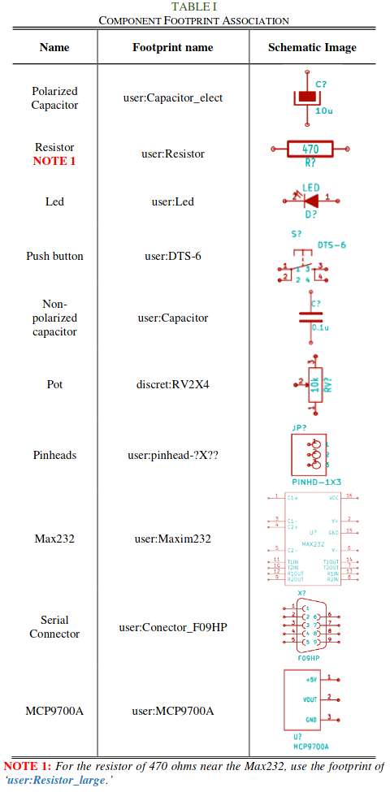
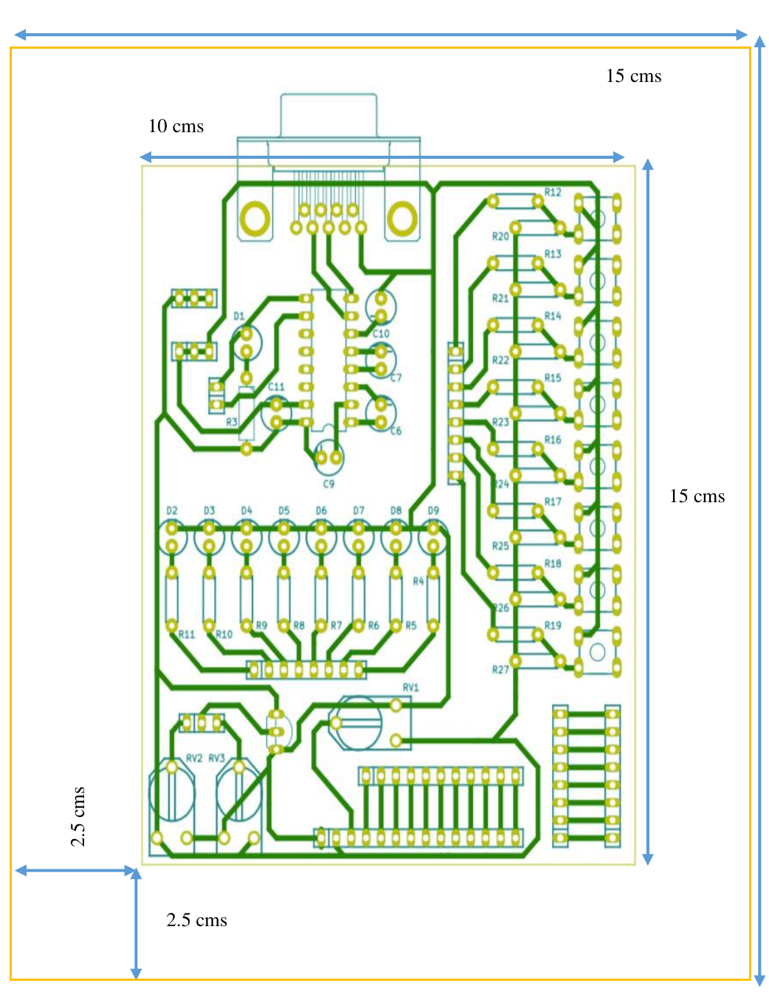

# Practice 2. Developiong the PCB (Layout)

## Objectives

Develop the connection diagrams (layout) from the schematic diagram.

## Introduction

Microcontrollers are all around  he world. Each day, Microcontrollers, are more present in the many aspects of our lives: in our work, inside our houses, and in more. We can find them controlling small devices like cellphones, microwaves, washing machines, and televisions.

A microcontroller is one device or chip that is used to govern one or more processes. For example, the controller that regulates the room temperature of an air conditioner; it has a sensor that continuously measures the internal temperature and, when the preset limits are exceeded, it generates the necessary signals to adjust the temperature.

## State of the Art

### The practices and the PIC microcontroller

The main objective of this practices is to provide students the foundation to fully understand the operation of the PIC18F45K50 microcontroller. This will be achieved through 11 documents that will guide the reader to create their own electronic card or Printed Circuit Board (PCB) and to be able to program it; in order to, execute different functions.

The advantages of ta PIC microcontroller to others on the market, which is why it will be used throughout this manual, are as follows:

- Easy to operate.
- There is enough documentation to work with it and it’s easy to obtain it.
- The price is comparatively lower than its competitors.
- It has a high operating speed.
- Development tools are cheap and easy to use.
- There are a variety of hardware that can record, erase and check the behavior of PIC.
- Once you learn to handle a PIC, it will easier to handle any other models of microcontrollers.

### KiCad EDA Software

KiCad is an open source software suite for Electronic Design Automation (EDA). The programs handle Schematic Capture,
and PCB Layout with Gerber output. The suite runs on Windows, Linux and macOS and is licensed under GNU GPL v3. The
first release date was in 1992 by its original author, Jean-Pierre Charras, but is now currently under development by
the KiCad Developers Team. 

## Results

In this section, you must report the outcomes of the laboratory activities.

### Follow the next 'Project Configuration' Steps

1. In  the  same  project  from  practice  1,  click  on  the  icon ‘Assign PCB footprints to schematic symbols’.  By  doing  so,  you  will  be  able  to  watch  the  footprints associations in a list format. ***NOTE:*** *If a ***‘Confirmation’*** window pops to reassign all the components to a new library format, click ‘No.’*

2. Now it is time to add the corresponding libraries to the Cvpcbprogram.   Download from [here](./modules)  the modules   needed   for   the   project.   Click   on Preferences→Manage Footprint Libraries...and  in this  way  you  will  be  able  to  add  the  modules  from the folder  named  ‘modules.’  Click  on  ‘Project  Specific Libraries...’  tab,  then  click  on  the  button  ‘Browse Libraries...’ and search for the folder  where  you  save the modules. Select all the files and click ‘OK.’Fig.  1 shows the result of the added modules. NOTE:Your KiCad EDA Software must be in english to add the modules.

3. Once  that  is  done,  you  must  associate  the  list  of components  with  its  respective  footprint using Table  I for  guidance.  Be  sure  to  activate  the  option  ‘Filter footprints  list  by  library’ from  the Cvpcbtoolbar. To associate  the  components  showed  in  the middle  column,  double  click  with  their  corresponding footprint from the right column. ***NOTE:*** *Search  all  the  footprints  in  the*  ***‘user’*** *and * 
***‘discrete’*** * added libraries that should be found at the end of the list.*

4. Save   your modifications  by  clicking  **‘Apply,  Save Schematic & Continue,’ and then click ‘OK.’**
5. After that, you may close the Cvpcband go back to the EESchema (Schematic  Editor.)  Save  your  project  by clicking   on File→Save.   Close   the   editor   of   the Schematic and switch back to the **‘Project Manager.’**

6. Once you have the design of the circuit on the schematic, it is time to generate the **‘layout’** of our PCB  using the Netlist  file. On  the Project  Manager program  from KiCad, click on the icon **‘PCB layout editor’** . A new window will appear from the PCBNew. Click **‘Yes’** in the confirmation window.
7. On  the  toolbar  menu  from  the PCBNew click  on  the **‘Page  Settings  for  paper  size  and  texts’**
and modify the size settings to **‘USLetter 8.5x11in.’**

8. After  that,  it  will be  time  to  focus  more  on  design concepts.  You  may  do  so  by  opening  the
menu  of **‘Setup→Design Rules...’**. On   it,   some   final   design characteristics will appear with many millimeter values. Between   them,   you   should   find  the  **‘Clearance’** specification  which  is  the  smallest  spaces  that  it  must exist  between  the tracks  on the  PCB.  You  shall  set the value of this cell to 0.508 mm (0.020 inches.) Next, we set  a  value  of 1.200  mm  (0.047244 inches)on the  cell of **‘Track Width.’** 

9. Switch now to the ‘Global Design Rules’ tab and write, if needed, the minimum values for each an every one of the parameters on the ‘Minimum Allowed Values’ box. Click ‘OK.’

10. Time  to  import  the  Netlist  file.  Go  to  the  toolbar ‘Tools→Update  PCB  from  Schematic...’  and  then click on ‘Update  PCB.’ When  you  close  the  window all the components will appear on the screen.

11.Check in the ‘Layers Manager’ window (located at the right  part  of  your  screen) that all  the needed  boxes  are
checked, as shown:

11.Check in the ‘Layers Manager’ window (located at the right  part  of  your  screen) that all  the needed  boxes  are checke

12. Now you  have  to  define  the  limits  of  the  PCB.  First, highlight  the  ‘Edge.Cuts’  layer.  Then,  select  the  ‘Add  graphic lines’ tool and began to trace the original measures of your copper board (15x20 cm.) You must also define the  cutting  area;  do  not  forget  to  add  a  2.5  cm  margin around the board. To measure the lines, you can use the ‘Add dimension’ tool located on the right.

13. It is your turn to move all the components in the circuit in  order  to  avoid  any  track  intersection  inside  the working   area.   You   can   move   the   components   by positioning your mouse pointer above it and pressing the key [G]. All the components are connected to each other by a group of wires called ratsnest. Make sure that the icon  of  **‘Hide  board  ratsnest’** located  in  the toolbar of the left is highlighted.

14. Now you must link all the connections of you PCB. But before  that,  you  must  change  the  drawing  option  from the right toolbar from ‘Edge.Cuts’ to ‘B.Cu (PgDn)’ (B->Bottom, Cu->Copper.).

15. Start to connect your tracks to each and every one pin on the schematic by using the icon ‘Route Tracks’. Trace  all  the  routes  for  each  net  or  connection  in  your PCB design.

16. Once  your  are  done,  save  your  layout  File->Save  or using the command [Ctrl + S].

17. Your board must look like:

### Report
For this practice, modify only the Conclusion section. Commit an push the changes on the fork of this repository and add
upload the link on Canvas.

### File uploads
Commit and push the files with extensions .pro and .kicad_pcb created once you completed all the steps of the document in the repository.

### Demonstration
Screenshot the image of the complete schematic and upload it at the repository.

## Conclusion

In this section, you should add the conclusions, suggestions, and/or problems of the laboratory activities. Each team member must add his/her own conclusion (5 lines as minimum for each member).
