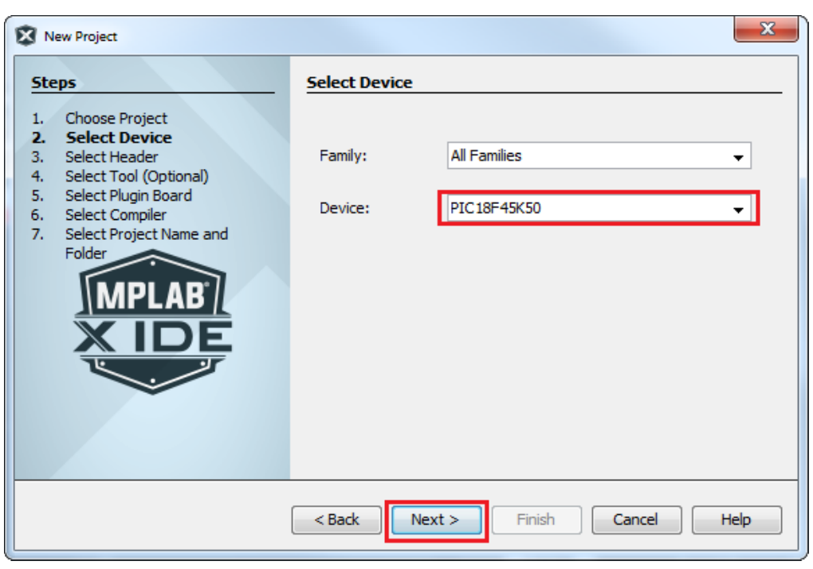
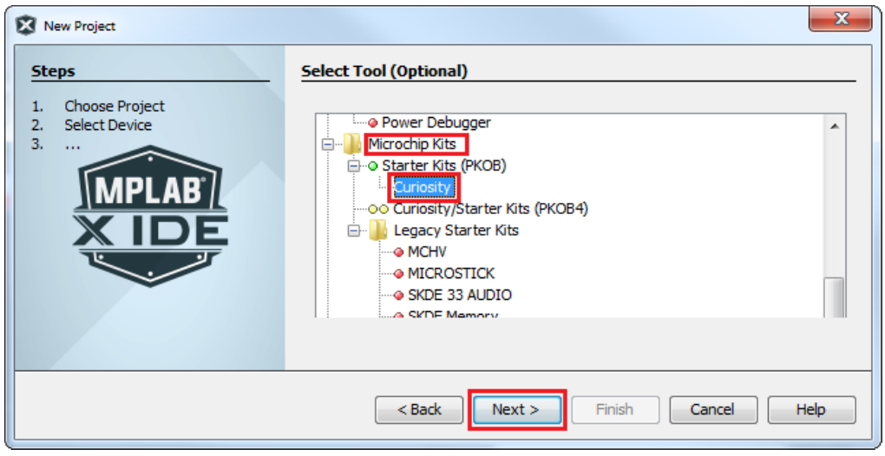
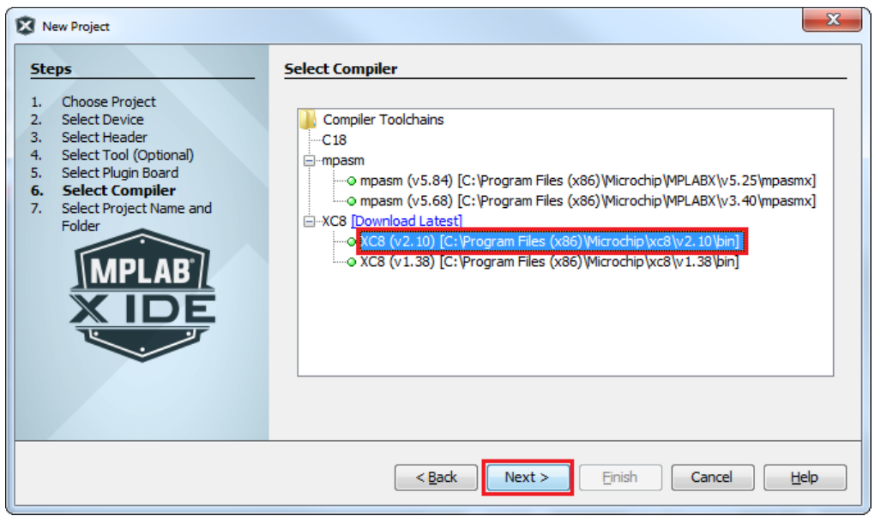
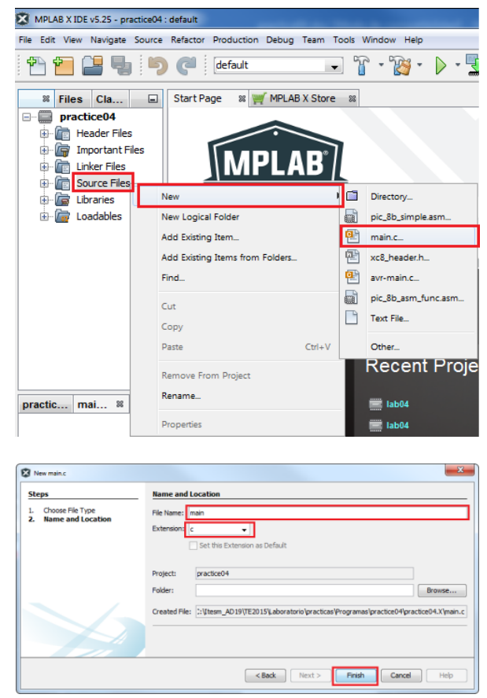
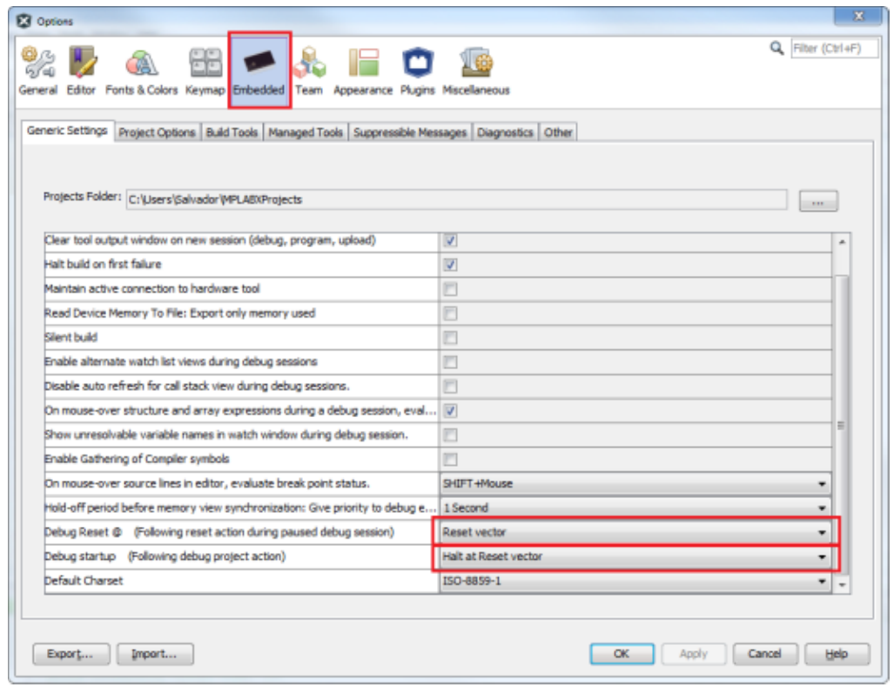
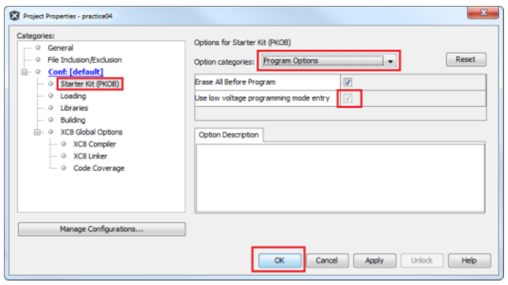
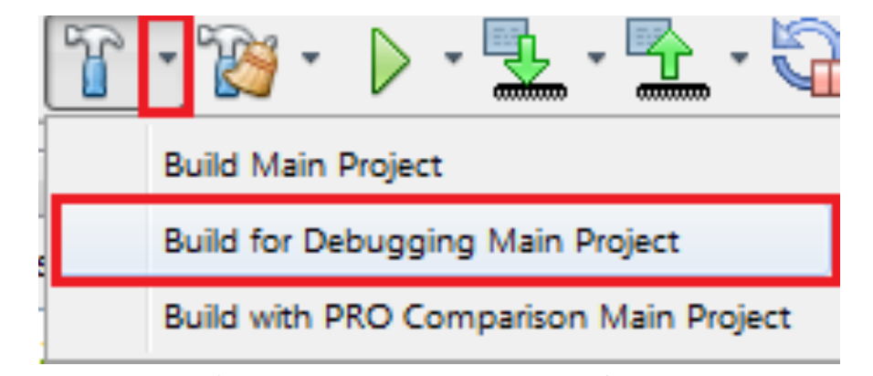
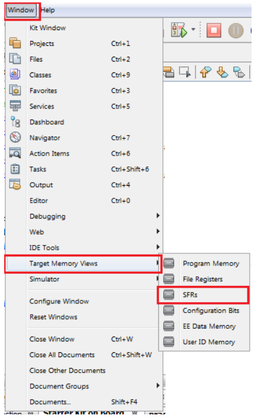

# Practice 5. Introduction to using MPLAB X IDE

## Objectives
The student will become familiar with the MPLAB
integrated development environment tools. The student
will create his (her) first program using the MPLAB
software and will put it into the PIC microcontroller
making use of the Curiosity development/evaluation
board.

## Introduction

Microcontrollers are all around  he world. Each day, Microcontrollers, are more present in the many aspects of our lives: in our work, inside our houses, and in more. We can find them controlling small devices like cellphones, microwaves, washing machines, and televisions.

A microcontroller is one device or chip that is used to govern one or more processes. For example, the controller that regulates the room temperature of an air conditioner; it has a sensor that continuously measures the internal temperature and, when the preset limits are exceeded, it generates the necessary signals to adjust the temperature.

## State of the Art

### The practices and the PIC microcontroller

The main objective of this practices is to provide students the foundation to fully understand the operation of the PIC18F45K50 microcontroller. This will be achieved through 11 documents that will guide the reader to create their own electronic card or Printed Circuit Board (PCB) and to be able to program it; in order to, execute different functions.

The advantages of ta PIC microcontroller to others on the market, which is why it will be used throughout this manual, are as follows:

- Easy to operate.
- There is enough documentation to work with it and it’s easy to obtain it.
- The price is comparatively lower than its competitors.
- It has a high operating speed.
- Development tools are cheap and easy to use.
- There are a variety of hardware that can record, erase and check the behavior of PIC.
- Once you learn to handle a PIC, it will easier to handle any other models of microcontrollers.

### MPLAB X
MPLAB X Integrated Development Environment (IDE) is an expandable, highly configurable software program that incorporates powerful tools to help you discover, configure, develop, debug and qualify embedded designs for most of Microchip’s microcontrollers and digital signal controllers. MPLAB X IDE works seamlessly with the MPLAB development ecosystem of software and tools, many of which are completely free. 

### CURIOSITY development board
The Curiosity HPC Development Board is a 8-bit prototyping board. It is designed from the ground-up to take full advantage of Microchip’s MPLAB® X integrated development environment. The Curiosity Development Board supports Microchip’s 28- and 40-pin 8-bit PIC MCUs. Programming/debugging is accomplished through the PICkit On Board (PKOB), eliminating the need for an external programming/debugging tool.

## Results

In this section, you must report the outcomes of the laboratory activities.

### Install the MPLAB IDE

1. Go to https://www.microchip.com/mplab/mplab-x-ide, scroll down to “Downloads” section and download the ‘MPLAB X

### Create, Compile and Debug your First Program

2. Connect the Curiosity board to your PC.

3. Start the MPLABX IDE program. Go to File->New Project and select the “Microchip Embedded” and “Standalone Project” options. Then Click on “Next”.

4. Selecct the PIC18F45K50 device and Click on “Next”.

5. Choose the “Curiosity” option and Click on “Next”

6. Choose the XC8 Compiler Toolchain to build the program ans Click on “Next”.

7. Select the “Project Location” and “Project Name”. Make sure that the location and the name have no special characters and no spaces in the names of the directories or filenames. Then Click on “Finish”.

8. Right-Click on “Source Files” and open a new “main.c” file. and Click on “Finish”.

9. Download ‘device\_config.h’ header file. Right-Click on “Header Files” and Click on “Add Existing Item”. Choose the downloaded file and Click on Select.

10.  Select the Tools and click on “Options”.

11. Click on “Embedded ” and select following options: “Reset vector”, “Halt at Reset vector”

12. Go to “File” and Click on “Project properties”.

13. Ensure that the “Low voltage programming mode” option is cheked.

14. Select “Build for Debugging Main Project”.

15. Select “Debug Main Project”.

16. You can use the debug buttons to go step by step from beginning to end through the program.

17. Before start, activate the windows that let us to see what is happening inside the microcontroller. On this
window you can select what you want to verify, for example general purpose file registers (GPRs), Special file registers (SFRs), etc.

18. Now debug the program by executing the code step-by-step.

19. Your code must be like the main.c of the repository.

### Report
For this practice, add to the Result Section the following:
    - image of the BUILD SUCCESSFUL window.
    - image of each modified register for the portInit() function when you debug the code step by step. TIP: Put a breakpoint at the first line of the porInit( ) function and open the IO window (Window → Debugging → IO View). Also, modify the Conclusions Section and your names at the top of the document.

### File uploads
Commit and push the file main.c created once you completed all the steps of the document in the repository.

### Demonstration
Record a video of the practice’s functionality and upload it on youtube. The video must contain a short explanation.

## Conclusion

In this section, you should add the conclusions, suggestions, and/or problems of the laboratory activities. Each team member must add his/her own conclusion (5 lines as minimum for each member).
