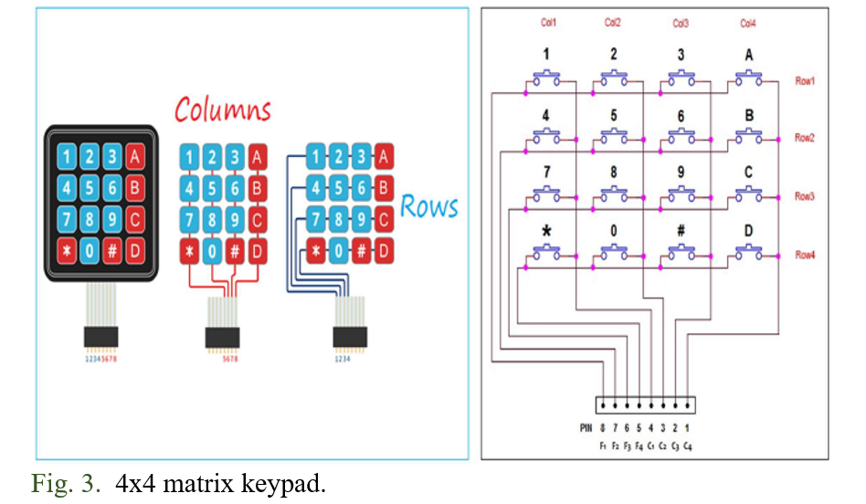
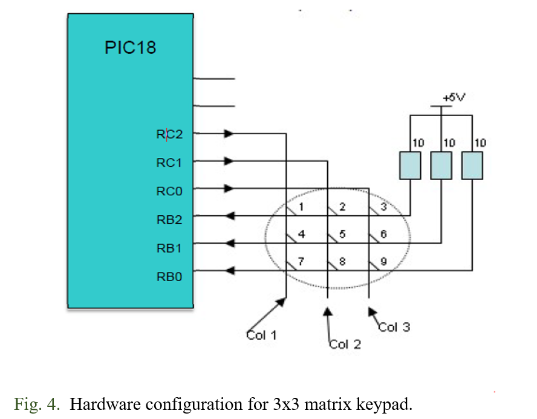
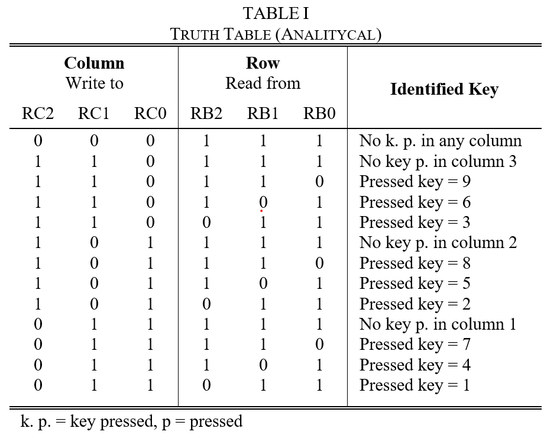
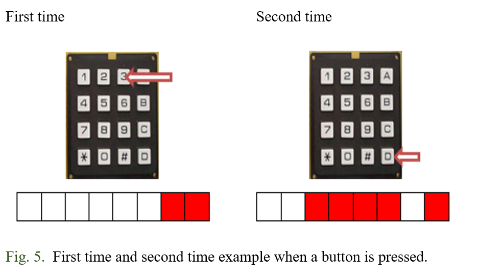

# Practice 7. Keypad 4x4 (GPIOs)

## Objectives
Knowing the functions and interactions of the pull-up resistors and input/output port. Acquiring data from a keypad by the sweeping method.
At the end of this practice, the student will be capable of: 

- Identify and know the importance of the pull-up/pull-down settings in a microcontroller.
- Understand the concept of sweeping for data acquisition.

## Introduction

Microcontrollers are all around  he world. Each day, Microcontrollers, are more present in the many aspects of our lives: in our work, inside our houses, and in more. We can find them controlling small devices like cellphones, microwaves, washing machines, and televisions.

A microcontroller is one device or chip that is used to govern one or more processes. For example, the controller that regulates the room temperature of an air conditioner; it has a sensor that continuously measures the internal temperature and, when the preset limits are exceeded, it generates the necessary signals to adjust the temperature.

## State of the Art

### The practices and the PIC microcontroller

The main objective of this practices is to provide students the foundation to fully understand the operation of the PIC18F45K50 microcontroller. This will be achieved through 11 documents that will guide the reader to create their own electronic card or Printed Circuit Board (PCB) and to be able to program it; in order to, execute different functions.

The advantages of ta PIC microcontroller to others on the market, which is why it will be used throughout this manual, are as follows:

- Easy to operate.
- There is enough documentation to work with it and it’s easy to obtain it.
- The price is comparatively lower than its competitors.
- It has a high operating speed.
- Development tools are cheap and easy to use.
- There are a variety of hardware that can record, erase and check the behavior of PIC.
- Once you learn to handle a PIC, it will easier to handle any other models of microcontrollers.

### Pull-up functionality
In a logic circuit is very important to ensure, at every moment, a known state for a signal (High, Low). A pull-up resistor is used to ensure a well-defined voltage (i.e. Vcc), and in combination with switches this level can be changed, as shown in Fig. 1.

### C.	Keypad  functionality
The basic principle of a matrix keypad is that we connect more than switch to a single input of a microcontroller, as shown in Fig. 2.

Next step is to extend the configuration to get an ‘n x m’ button array, that is a matrix keypad, as shown in Fig. 3.

The next example examines a 3x3 row-column keypad. A hardware configuration with the microcontroller is shown in Fig. 4. The pull-up resistors must be enabled for RB.

The following Table I specifies the RC and RB levels useful to identify the pressed buttons. Assume that 8 LEDs are connected to Port D.

## Results

In this section, you must report the outcomes of the laboratory activities.

### main.c programming structure.

Remember to follow the programming structure: 

1.	Start your C program with the “LIBRARIEs / HEADERs SECTION” section… 

2.	Continue your C code with the “DIRECTIVEs SECTION” section… 

3.	Next, write the “DATA TYPEs SECTION” section.

4.	Now, write the “FUNCTIONs DECLARATION” section…

5.	It is time for the “MAIN” section… 

6.	Last step is to write the “FUNCTIONs” section… 

### Keypad: Software implementation.

7.	Create a new project in the MPLAB X IDE for the “Curiosity” board (PIC18F45K50 microcontroller). More details are presented in Practice 5.

8.	Create a C program to do the following:
    *   Show the corresponding binary output of the button pressed from the 4x4 matrix keypad. The binary output should be showed in the LEDs of your “minimum card system.” 
        NOTE: The ‘#’ symbol must show the ‘E’ binary value and the ‘*’ symbol must show the ‘F’ binary value.
    * When a button is pressed for the first time, the number/letter value should be showed in the least significant four LEDs.
    *	When a new button is pressed, the last number should be shifted out to the most significant four LEDs, and the new number should be showed in the least significant LEDs, as shown in Fig. 5.

### C.	Keypad: Hardware implementation.
9.	Connect PortB of PIC18 to the appropiate pinhead of your “minimum card system,” then connect the 4x4 matrix keypad to the opposite pinhead, and finally connect PortD of the microcontroller to the LEDs set. Your connection must look like the one shown in Fig. 6 at the end of this document.

### Report
For this practice, add to the Result Section the following:
    - image of the BUILD SUCCESSFUL window.
    - image of the connections between the Curiositiy board and  your minimum card system (Proteus). The image must contain a short description, and a footnote.
    - description of the problems found and solutions.
    - flow diagram of your program implementation.

### File uploads
Commit and push the file main.c created once you completed all the steps of the document in the repository.

### Demonstration
Record a video of the practice’s functionality and upload it on youtube. The video must contain a short explanation.

## Conclusion
In this section, you should add the conclusions, suggestions, and/or problems of the laboratory activities. Each team member must add his/her own conclusion (5 lines as minimum for each member).
