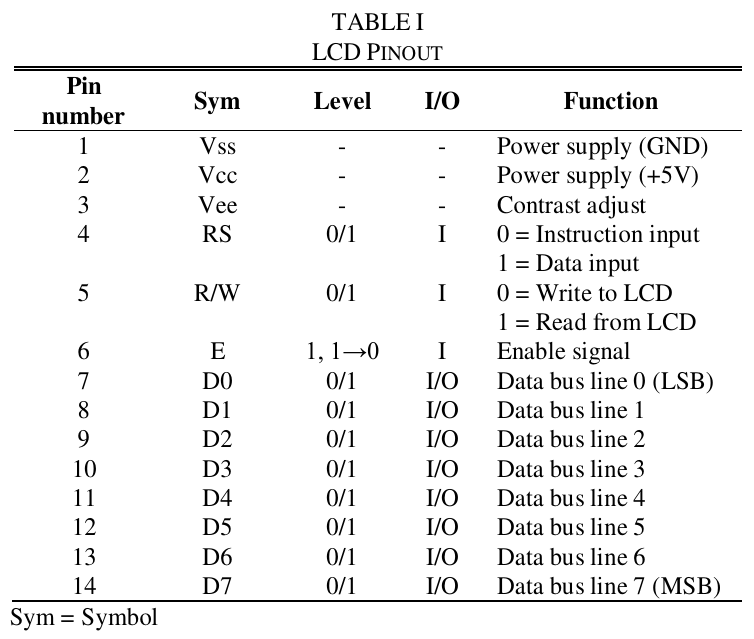
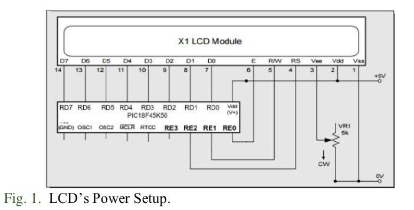
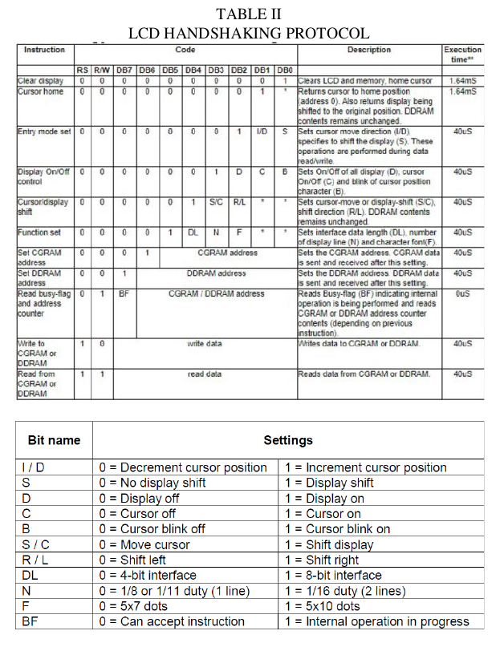
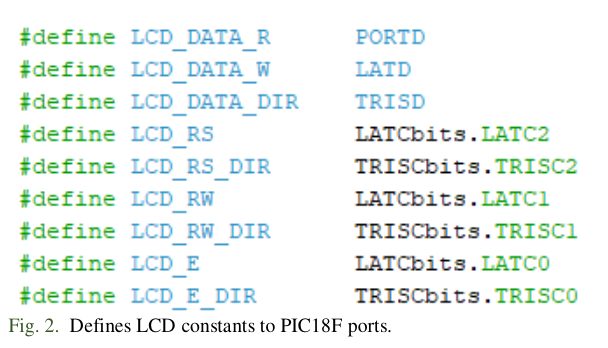
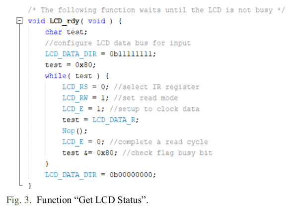
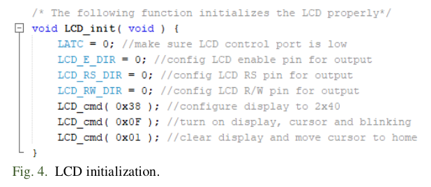
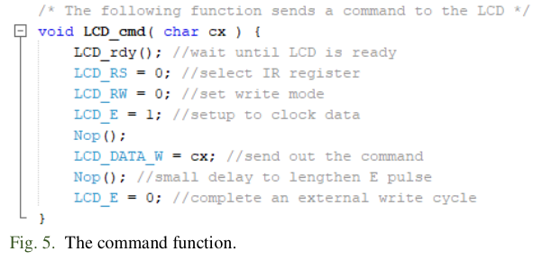
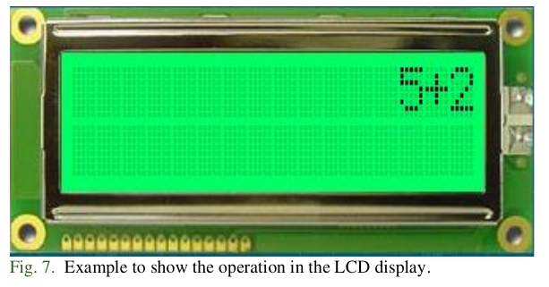
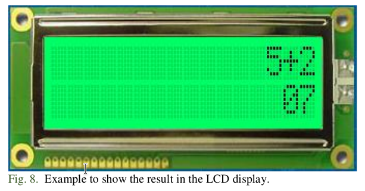
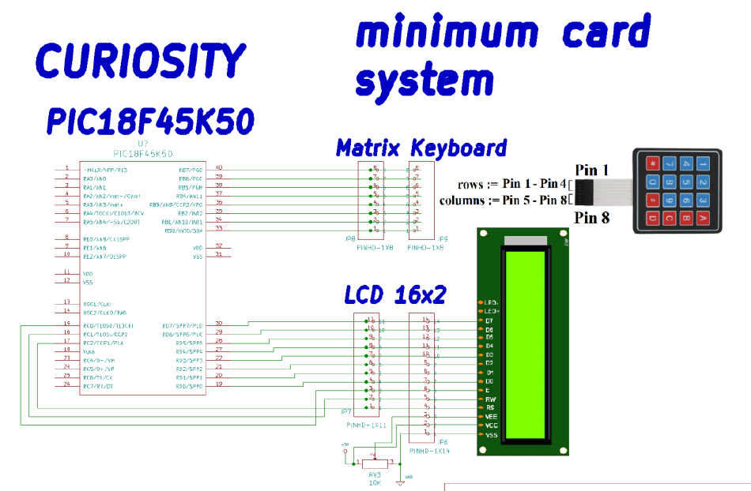

# Practice 8. LCD Display (GPIOs)

## Objectives
To study and use a Liquid Crystal Display (LCD) as a graphic terminal for the Microcontroller. Knowing the
main functions and characteristics of the device. At the end of this practice, the student will be capable of:
- Configure and integrate a LCD to the following practices of this lab.

## Introduction

Microcontrollers are all around  he world. Each day, Microcontrollers, are more present in the many aspects of our lives: in our work, inside our houses, and in more. We can find them controlling small devices like cellphones, microwaves, washing machines, and televisions.

A microcontroller is one device or chip that is used to govern one or more processes. For example, the controller that regulates the room temperature of an air conditioner; it has a sensor that continuously measures the internal temperature and, when the preset limits are exceeded, it generates the necessary signals to adjust the temperature.

## State of the Art

### The practices and the PIC microcontroller

The main objective of this practices is to provide students the foundation to fully understand the operation of the PIC18F45K50 microcontroller. This will be achieved through 11 documents that will guide the reader to create their own electronic card or Printed Circuit Board (PCB) and to be able to program it; in order to, execute different functions.

The advantages of ta PIC microcontroller to others on the market, which is why it will be used throughout this manual, are as follows:

- Easy to operate.
- There is enough documentation to work with it and it’s easy to obtain it.
- The price is comparatively lower than its competitors.
- It has a high operating speed.
- Development tools are cheap and easy to use.
- There are a variety of hardware that can record, erase and check the behavior of PIC.
- Once you learn to handle a PIC, it will easier to handle any other models of microcontrollers.

### Intelligent LCD display
The device has two lines and 20 characters per line. The pinout of the LCD is shown in Table I. To locate pin 1 check the numbering on the LCD.

The following diagram shows the way to connect the LCD to power and to the Microcontroller.

The handshaking protocol for the LCD is shown in Table II.

The 44780 standard requires 3 control lines as well as either 4 or 8 I/O lines for the data bus. The user  may select whether the LCD is to operate with a 4-bit data bus or an 8-bit data bus. If a 4-bit data bus is used, the LCD will require a total of 7 data lines (3 control lines plus the 4 lines for the data bus). If an 8-bit data bus is used, the LCD will require a total of 11 data lines (3 control lines plus the 8 lines for the data bus). The three control lines are referred to as EN, RS and RW.

1. The EN line is called “Enable.” This control line is used to tell the LCD that you are sending it data. To send data to the LCD, your program should first set this line high (1) and then set the other two control lines and/or put data on the data bus. When the other lines are completely ready, bring EN to low (0) again. The 1→0 transition tells the 44780 to take the data currently found on the other control lines and on the data bus, and to treat it as a command.

2. The RS line is called “Register Select.” When RS is low (0), the data is to be treated as a command or special instruction (such as clear screen, position cursor, etc.) When RS is high (1), the data being sent is text data which should be displayed on the screen. For example, to display the letter “T” on the screen you would set RS to high.

3. The RW line is called “Read/Write.” When RW is low (0), the information on the data bus is being written to the LCD. When RW is high (1), the program is effectivel querying (or reading) the LCD. Only one instruction (“Get LCD status”) is a read command. All others are write commands, so RW will almost always be low.

The data bus consists of 4 or 8 lines (depending on the mode
operation selected by the user). In the case of an 8-bit data bus,
the lines are referred to as RD0, RD1, RD2, RD3, RD4, RD5,
RD6 and RD7.

### Configuration Example

The LCD requires either 8 or 11 I/O lines to communicate with. This is an 8-bit data bus example. For the program to access the LCD, equate constants to the PIC18F ports in order to identify the lines by their 44780 name, as shown in Fig. 2

The following instruction illustrates how the equates are used to define the output levels in the ports. For example, to set the RW line high (1), the following instruction is required:LCD_RS = 1.

### Handling the EN control line

The EN line is used to tell the LCD to execute an instruction available on the data bus. The EN line must be set to high before an instruction and set low after an instruction. The EN line must be manipulated whether the instruction is a read/write or is text/instruction.

Use this instruction to set EN signal high: LCD_E = 1;

Use this instruction to set EN signal low: LCD_E = 0;

Programming Tip: The LCD interprets and executes a command at the instant the EN line is set to low. If the EN signal is not low, instructions are not executed. The LCD requires an amount of time to execute an instruction after setting EN low. The amount of time required for instruction execution depends on the instruction and the speed of the crystal attached to the 44780’s oscillator input.

### Checking the busy status on the LCD

The “Get LCD Status” command determine whether the LCD is still busy executing the last instruction received. This command returns two bits. The DB7 bit provides the information about the status of the LCD. The LCD returns a high level on DB7 if the LCD is still busy on instruction execution. The LCD returns a low level on DB7 if the LCD is no longer busy and ready to receive and execute a new command. The function for “Get LCD Status” is written in Fig 3.

An instruction must first be sent to the LCD and then call the LCD_rdy function to wait until the instruction is completely executed by the LCD. This ensures the program gives the LCD the time it needs to execute instructions and also makes programs compatible with any LCD, regardless of how fast or slow it is.

### LCD initialization
The LCD must be initialized and configured before displaying data. This is accomplished by sending a few initialization instructions to the LCD. The first instruction indicates to the LCD the type of communication: and 8-bit or 4-bit data bus. The first instruction must also se the 5x8 dot character font. These two options are selected by sending the command 38h to the LCD as a command. The RS line must be
low for sending a command to the LCD. The following instructions send the first command. The second initialization byte is the instruction 0Fh. This instruction turns the LCD ON and the cursor ON. It is necessary to repeat part of the sequence described in Fig 4

The command function “LCD_cmd” is as follows (see Fig.5):

Write text (sends a character to the LCD) to the LCD as is shown in Fig 6.

The 44780 contains a certain amount of memory assigned to the display. All of the written text is stored in this memory, and the 44780 subsequently reads this memory to display the text on the LCD itself. The first character in the upper left-hand corner is at address 00h. The following character position (character #2 on the first line) is address 01h, etc. This continues until we reach the 16th character of the first line which is at address 0Fh. However, the first character of line 2 is at address 40h. This means if we write a character to the last position of the first line and then write a second character, the second character will not appear on the second line. That is because the second character will effectively be written to address 10h, but the second line begins at address 40h. Thus, we need to send a command to the LCD that tells it to position the cursor on the second line. The “Set Cursor Position instruction is 80h. To this, we must add the address of the location where we wish to position the cursor, 80h + 40h = C0h. Sending the command C0h to the LCD will position the cursor on the second line at the first character position.

## Results

In this section, you must report the outcomes of the laboratory activities.

### main.c programming structure.

Remember to follow the programming structure: 

1.	Start your C program with the “LIBRARIEs / HEADERs SECTION” section… 

2.	Continue your C code with the “DIRECTIVEs SECTION” section… 

3.	Next, write the “DATA TYPEs SECTION” section.

4.	Now, write the “FUNCTIONs DECLARATION” section…

5.	It is time for the “MAIN” section… 

6.	Last step is to write the “FUNCTIONs” section… 

###  Calculator: Software implementation.
7. Create a new project in the MPLAB X IDE for the “Curiosity” board (PIC18F45K50 microcontroller).
8. Create a C program to do the following:

    i. The program should take an arithmetic operator ‘+(addition), - (substraction), * (multiplication), (division)’ and two operands from a 4x4 matrix keypad in order to perform a calculation. The operator and operands should be shown in a LCD display, as shown in Fig. 7.

    ii. When the user press the ‘*’ symbol from the keypad, the display clears the operation and write the result from the performed calculation, as shown in Fig. 8.

    iii. In order to perform a new calculation, the user must press the ‘#’ symbol from the keypad. This action must clear the display an return the cursor to home. 
    iv. Then, a new calculation can be entered. 
    v. It is sufficient if the range of the operands is 0 to 9. Also, the result can only be positive and integer number.
    vi. Table III, shows the mapping of the keypad symbols with the calculator implementation.

### Calculator: Hardware implementation.

9.	 Connect PortB of PIC18 to the appropiate pinhead of your “minimum card system,” then connect the 4x4 matrix keypad to the opposite pinhead.

10. Insert the LCD display in the 14-pinhead. Then, connect PortD of the microcontroller to the opposite 11-pinhead that is mapped with the data bus (D0-D7) of the LCD display. Then, connect the remain pins (of the pinhead) that are mapped with the control bus of the LCD to the RC0 (E), RC1 (RW) and RC2 (RS) pins of the PIC18.  Your connection must look like the one shown in Fig. 9 at the end of this document. Next to these pinheads, there is a potientiometer. You can adjust this POT to controll the contrast of the display.

### Report
For this practice, add to the Result Section the following:
    - image of the BUILD SUCCESSFUL window.
    - image of the connections between the Curiositiy board and  your minimum card system (Proteus). The image must contain a short description, and a footnote.
    - description of the problems found and solutions.
    - flow diagram of your program implementation.

### File uploads
Commit and push the file main.c created once you completed all the steps of the document in the repository.

### Demonstration
Record a video of the practice’s functionality and upload it on youtube. The video must contain a short explanation.

## Conclusion
In this section, you should add the conclusions, suggestions, and/or problems of the laboratory activities. Each team member must add his/her own conclusion (5 lines as minimum for each member).
