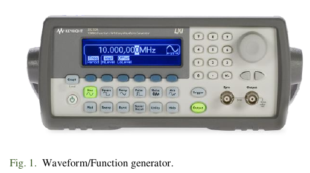
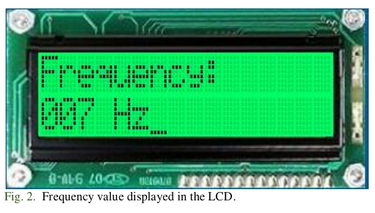
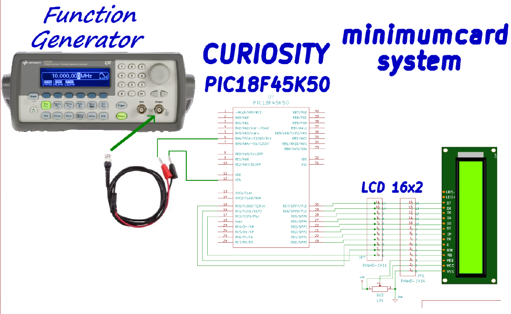

# Practice 9. Timers Module

## Objectives
The student will write a C language program where he will use the timer modules to count events and times
interval. At the end of this practice, the student will be capable of:
- Make calculations for timing requirements in applications in order to configure and program the
timers.
- Write different code routines for timing task such as event counter and time generator.

## Introduction

Microcontrollers are all around  he world. Each day, Microcontrollers, are more present in the many aspects of our lives: in our work, inside our houses, and in more. We can find them controlling small devices like cellphones, microwaves, washing machines, and televisions.

A microcontroller is one device or chip that is used to govern one or more processes. For example, the controller that regulates the room temperature of an air conditioner; it has a sensor that continuously measures the internal temperature and, when the preset limits are exceeded, it generates the necessary signals to adjust the temperature.

## State of the Art

### The practices and the PIC microcontroller

The main objective of this practices is to provide students the foundation to fully understand the operation of the PIC18F45K50 microcontroller. This will be achieved through 11 documents that will guide the reader to create their own electronic card or Printed Circuit Board (PCB) and to be able to program it; in order to, execute different functions.

The advantages of ta PIC microcontroller to others on the market, which is why it will be used throughout this manual, are as follows:

- Easy to operate.
- There is enough documentation to work with it and it’s easy to obtain it.
- The price is comparatively lower than its competitors.
- It has a high operating speed.
- Development tools are cheap and easy to use.
- There are a variety of hardware that can record, erase and check the behavior of PIC.
- Once you learn to handle a PIC, it will easier to handle any other models of microcontrollers.

### Function generator

A waveform/function generator, see Fig. 1, is an instrument
used in electronics that serves to generate or simulate specific
signals with certain characteristics. For example, create or
simulate a signal that can be square, sinusoidal, of a certain
frequency, and of a certain amplitude. In this way, we can apply
this generated signal to a circuit to see its response.

Function Generator Configuration:
    - High impedance:
Utility → Output Setup → High Z → DONE.
    - Signal Type: Square.
    - Amplitude: 5 V peak to peak.
    - Offset: 2.5 V

### Time for roll over

$$Time = (2^TimerMode TMRx)(Tcy)(Prescaler)$$

Where:
    - TMRx: timer counter register.
    - Time: Period from "initial count" in TMRx to the moment when TMRx has an overflow (from 0xFF/0xFFFF to 0x00/0x0000).
    - TimerMode: It may be 16 or 8 bits
    - Tcy: Internal Instruction Cycle of 4/Fosc.
    - Prescaler: Device for frequency divider.

## Results

In this section, you must report the outcomes of the laboratory activities.

### main.c programming structure.

Remember to follow the programming structure: 

1.	Start your C program with the “LIBRARIEs / HEADERs SECTION” section… 

2.	Continue your C code with the “DIRECTIVEs SECTION” section… 

3.	Next, write the “DATA TYPEs SECTION” section.

4.	Now, write the “FUNCTIONs DECLARATION” section…

5.	It is time for the “MAIN” section… 

6.	Last step is to write the “FUNCTIONs” section… 

###  Measuring frequency
7. Create a new project in the MPLAB X IDE for the
“Curiosity” board (PIC18F45K50 microcontroller).

8. Create a C program to measure the frequency of a
function generator through the TIMER modules of the
PIC18F45K50, and display the corresponding
frequency value in the LCD display, as shown in Fig 2. 

9. Constraints•and indications:
    - You can not use the "delays.h" library.
    - The frequency range to read from the function generator is from 0 to 255 Hz.
    - Configure a TIMER for "roll over" in periodic intervals of 1 second. 
    - Design a counter with the TIMER0 module in order to detect the falling edges (frequency) that occur in 1 second.
    - First, Timer (e.g. TIMER 1) and Timer 0 must be enable almost at the same time (in fact first TIMER 1 and then TIMER 0) and after a interval of 1 second, the value of the TIMER 0 counter should be sent to the LCD display (because the count must correspond to the generator frequency).
    - Do not forget to reset the counters and clean the overflow flag of TIMER 1 (TMR1IF) at every second.
    - Your program must be able to continuously read and show the generator frequency in spite of generator changes its frequency value. In the LCD display, the ‘Frequency’ and ‘Hz’ labels must not disappear or been rewritten. The only replaced/rewritten characters should be the ‘values’.

### Measure frequency: Hardware implementation.

10. Configure Function generator as was shown in part II
section C. Connect the Function Generator to the
External Clock signal for TIMER 0 (RA4/T0CKI pin)
of the PIC18. Make a connection to make common the
PIC18 GND and the GND of the Function Generator.
Connect the LCD display in the same fashion as done
in Practice 8. Your final implementation must be
like the one shown in figure 3.

### Report
For this practice, add to the Result Section the following:
    - image of the BUILD SUCCESSFUL window.
    - image of the connections between the Curiositiy board and  your minimum card system (Proteus). The image must contain a short description, and a footnote.
    - description of the problems found and solutions.
    - flow diagram of your program implementation.

### File uploads
Commit and push the file main.c created once you completed all the steps of the document in the repository.

### Demonstration
Record a video of the practice’s functionality and upload it on youtube. The video must contain a short explanation.

## Conclusion
In this section, you should add the conclusions, suggestions, and/or problems of the laboratory activities. Each team member must add his/her own conclusion (5 lines as minimum for each member).
